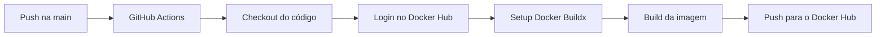
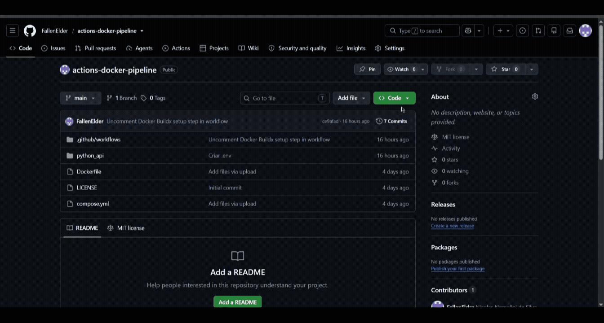

# actions-docker-pipeline

Pipeline de CI/CD construído com **GitHub Actions** que, a cada push na branch `main`, faz o build automático de uma imagem Docker e a publica no **Docker Hub**.

Este projeto foi desenvolvido como prática de fundamentos de DevOps: automação de pipelines, integração com registries de imagens e gerenciamento seguro de credenciais via GitHub Secrets.

> A aplicação usada (FastAPI + MySQL) serve apenas como base para demonstrar o pipeline. O foco do projeto é o workflow de CI/CD.

## 🛠️ Tecnologias utilizadas

- **GitHub Actions** — orquestração do pipeline
- **Docker** e **Docker Buildx** — build da imagem
- **Docker Hub** — registry de destino da imagem
- **Python 3.13** + **FastAPI** — aplicação de suporte

## ⚙️ Como funciona o pipeline



O workflow está definido em `.github/workflows/publicar_dockerhub.yml` e executa os seguintes steps:

| Step | Descrição |
|---|---|
| `actions/checkout@v4` | Faz checkout do código do repositório |
| `docker/login-action` | Autentica no Docker Hub via secrets |
| `docker/setup-buildx-action` | Configura o Docker Buildx |
| `docker/build-push-action` | Faz o build e publica a imagem no Docker Hub |

## 🔐 Configurando os secrets

As credenciais do Docker Hub são armazenadas como **GitHub Secrets** — nunca diretamente no código.

Para configurar, acesse **Settings → Secrets and variables → Actions** no repositório e crie os seguintes secrets:

| Secret | Descrição |
|---|---|
| `DOCKER_USER` | Seu usuário do Docker Hub |
| `DOCKER_PASSWORD` | Seu Access Token do Docker Hub |

> ⚠️ Use um **Access Token** do Docker Hub (gerado em Account Settings → Security), não a senha da conta. É mais seguro e pode ser revogado a qualquer momento.

## 📁 Estrutura do projeto

```
actions-docker-pipeline/
├── .github/
│   └── workflows/
│       └── publicar_dockerhub.yml
├── python_api/
│   ├── bd_com.py
│   ├── rotas.py
│   ├── requirements.txt
│   └── .env
├── video/
|   └── pipe-action.gif
├── Dockerfile
└── compose.yml
```

## 🖼️ Pipeline em execução



## 🐳 Imagem no Docker Hub

A imagem gerada pelo pipeline está disponível em:

https://hub.docker.com/r/fallenelder01/projetos-devops
```
fallenelder01/projetos-devops:python-api
```

## 🧠 Decisões técnicas

- **GitHub Secrets**: credenciais nunca expostas no código — armazenadas como secrets e referenciadas como variáveis no workflow
- **Docker Buildx**: utilizado no lugar do build padrão do Docker, garantindo compatibilidade e suporte a funcionalidades avançadas de build
- **Access Token**: autenticação no Docker Hub feita via token revogável, não com senha da conta
- **Trigger na main**: o pipeline só dispara em pushes na branch `main`, evitando builds desnecessários em branches de desenvolvimento

## 🚀 Possíveis melhorias futuras

- Adicionar step de testes automatizados antes do build
- Publicar a imagem com múltiplas tags (`latest` + `github.sha` para rastreabilidade)
- Adicionar notificação de sucesso/falha do pipeline (Slack, e-mail)
- Expandir para deploy automático em um servidor após o push da imagem

## 📄 Licença

Este projeto está sob a licença MIT.
